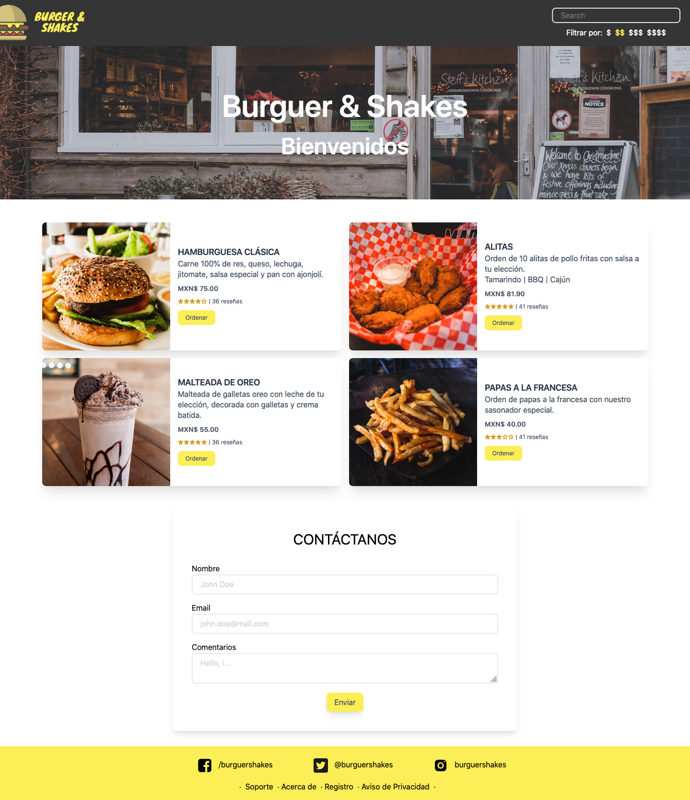

# Food App


## 🚀 Getting Started

Run the following command to install all dependencies.
```
$ npm install
```

## 🎨 Preview
You can see the result here → [Food-app](https://alexcamachogz.github.io/food-app/)

<details>
    <summary>🖥 Desktop version</summary>
    


</details>

<details>
    <summary>📱 Mobile version</summary>
    


</details>

## 👩🏻‍💻 Technologies
1. HTML
2. CSS
3. PostCSS
4. Tailwind CSS
